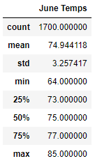
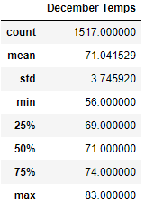
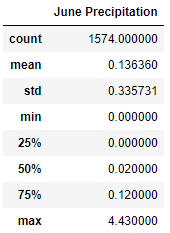
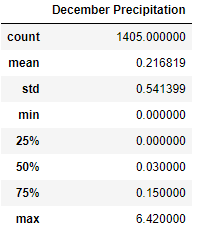
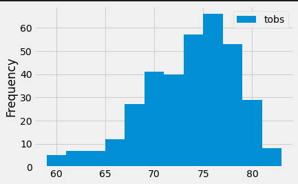

# surfs_up
## Overview of Project
In order to determine if the surf and ice cream shop business is sustainable year-round, we analyzing the temperature and precipitation in June and December. 
### Purpose
We filtered the date column of the Measurements table in the hawaii.sqlite database to retrieve all the temperatures for the month of June and December.
We did it using Python, Pandas functions and methods, and SQLAlchemy, you’ll 

## Results
- We can see that in June the average temperature is 74.5 and it is a bit lower than the December average of 71. 
- In December the minimum temperature is 9 degrees lower than June, 56 vs 64.
- The maximum temperature in June is 85 and in December is 83. 

## Summary
1.  When we look at the precipitation in December and June we can see the maximum in December is 6.42 and in June is 4.43. see the tables below
<<<<<<< HEAD

2. In order to understand the temperature throughout the year we analyzed the station with the highest number of temperature observations from 24-Aug-2016 to 23-Aug-2017 and see that most of the year the temperature is between 70 to 80.
 
=======

2. In order to understand the temperature throughout the year we analyzed the station with the highest number of temperature observations from 24-Aug-2016 to 23-Aug-2017 and see that most of the year the temperature is between 70 to 80. 
>>>>>>> 37a96e4 (Update README.md)

